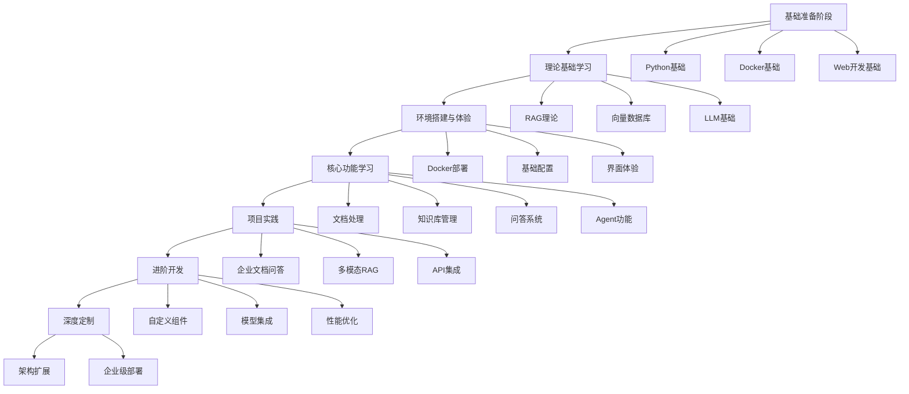

# RAGFlow 框架学习方案

## 📚 学习路线图



## 🎯 学习目标设定

### 初级目标（1-2周）
- ✅ 理解RAG的基本概念和原理
- ✅ 成功部署RAGFlow系统
- ✅ 完成基础的文档上传和问答操作
- ✅ 熟悉Web界面的各项功能

### 中级目标（3-4周）
- ✅ 掌握知识库和机器人的配置
- ✅ 理解不同解析模式的适用场景
- ✅ 能够通过API进行系统集成
- ✅ 完成一个完整的企业级应用

### 高级目标（5-8周）
- ✅ 掌握Agent工作流的设计
- ✅ 能够开发自定义组件
- ✅ 理解系统架构并进行性能优化
- ✅ 具备企业级部署和运维能力

## 📖 第一阶段：基础准备（建议时间：3-5天）

### 1.1 技术栈基础

#### Python基础
```python
# 必须掌握的Python概念
- 面向对象编程
- 异步编程（async/await）
- 包管理（pip, uv）
- 虚拟环境
- 常用库：requests, json, pandas

# 推荐学习资源
- Python官方教程
- 《Python编程：从入门到实践》
- 在线练习：LeetCode Python题目
```

#### Docker基础
```bash
# 必须掌握的Docker概念
docker run          # 运行容器
docker compose      # 容器编排
docker logs         # 查看日志
docker ps           # 查看容器状态
docker exec         # 进入容器

# 推荐学习资源
- Docker官方文档
- 《Docker技术入门与实战》
```

#### Web开发基础
```javascript
# 前端基础（可选，主要用于理解界面）
- HTML/CSS基础
- JavaScript ES6+
- React基础概念
- RESTful API概念

# 推荐学习资源
- MDN Web文档
- React官方教程
```

### 1.2 环境准备清单

```bash
# 硬件要求检查
✓ CPU: 4核心以上
✓ 内存: 16GB以上
✓ 硬盘: 50GB可用空间
✓ 网络: 稳定的互联网连接

# 软件安装清单
✓ Docker >= 24.0.0
✓ Docker Compose >= v2.26.1
✓ Git
✓ 代码编辑器（VSCode推荐）
✓ 浏览器（Chrome/Firefox）

# 可选工具
✓ Postman（API测试）
✓ MySQL客户端
✓ Redis客户端
```

## 🧠 第二阶段：理论基础学习（建议时间：5-7天）

### 2.1 RAG核心概念

#### 什么是RAG？
```
RAG = Retrieval-Augmented Generation
检索增强生成 = 信息检索 + 文本生成

核心流程：
1. 文档预处理和向量化
2. 用户查询的向量化
3. 相似性搜索找到相关文档
4. 将文档作为上下文传递给LLM
5. 生成增强的回答
```

#### RAG vs 微调模型
```
RAG优势：
✓ 知识可以实时更新
✓ 成本更低
✓ 可解释性强（可追溯来源）
✓ 适合企业知识库

微调优势：
✓ 响应速度快
✓ 知识融入模型参数
✓ 适合特定领域深度定制
```

### 2.2 向量数据库原理

#### 向量化过程
```python
# 文本向量化示例
from sentence_transformers import SentenceTransformer

model = SentenceTransformer('all-MiniLM-L6-v2')
text = "这是一段示例文档"
embedding = model.encode(text)
print(f"向量维度: {len(embedding)}")  # 通常是384或768维
```

#### 相似性搜索
```python
# 余弦相似度计算
import numpy as np

def cosine_similarity(vec1, vec2):
    return np.dot(vec1, vec2) / (np.linalg.norm(vec1) * np.linalg.norm(vec2))

similarity = cosine_similarity(query_vector, document_vector)
```

### 2.3 大语言模型基础

#### 提示词工程
```
系统提示词模板：
你是一个专业的AI助手，请基于以下文档内容回答用户问题：

文档内容：
{context}

用户问题：
{question}

回答要求：
1. 基于文档内容，准确回答问题
2. 如果文档中没有相关信息，请明确说明
3. 提供文档来源引用
```

## 🛠️ 第三阶段：环境搭建与体验（建议时间：2-3天）

### 3.1 快速部署

#### Step 1: 克隆项目
```bash
git clone https://github.com/infiniflow/ragflow.git
cd ragflow
```

#### Step 2: 环境配置
```bash
# 系统参数设置
sudo sysctl -w vm.max_map_count=262144

# 复制环境配置
cp docker/.env.example docker/.env

# 编辑配置文件（可选）
vim docker/.env
```

#### Step 3: 启动服务
```bash
cd docker

# 使用Infinity向量引擎（推荐）
docker compose --profile infinity up -d

# 验证部署
docker compose ps
curl http://localhost/health
```

### 3.2 初次体验任务

#### 任务1: 系统登录
```
1. 访问 http://localhost
2. 使用默认账户登录: admin / infiniflow
3. 熟悉主界面布局
```

#### 任务2: 创建知识库
```
1. 点击"知识库"菜单
2. 新建知识库："测试知识库"
3. 选择解析模式："智能模式"
4. 上传一个PDF文件
5. 观察解析过程和结果
```

#### 任务3: 配置机器人
```
1. 点击"对话"菜单
2. 新建助手："测试助手"
3. 关联之前创建的知识库
4. 进行简单的问答测试
```

### 3.3 常见问题排查

```bash
# 容器状态检查
docker compose ps

# 查看日志
docker compose logs ragflow-server

# 重启服务
docker compose restart ragflow-server

# 清理并重新部署
docker compose down
docker compose --profile infinity up -d
```

## 📊 第四阶段：核心功能学习（建议时间：7-10天）

### 4.1 文档处理深入学习

#### 支持的文档格式
```
✓ PDF文档
✓ Word文档（.docx）
✓ PowerPoint（.pptx）
✓ Excel文件（.xlsx）
✓ 文本文件（.txt）
✓ Markdown文件（.md）
✓ 图片文件（OCR）
```

#### 解析模式对比
```json
{
  "智能模式": {
    "特点": "自动识别文档结构",
    "适用": "复杂布局的文档",
    "处理": "表格、图片、多列布局"
  },
  "简单模式": {
    "特点": "基础文本提取",
    "适用": "纯文本文档",
    "处理": "快速简单处理"
  },
  "手动模式": {
    "特点": "自定义解析规则",
    "适用": "特殊格式文档",
    "处理": "完全可控的解析流程"
  }
}
```

#### 分块策略优化
```python
# 分块参数调优
chunk_config = {
    "chunk_size": 1000,        # 建议800-1500
    "chunk_overlap": 200,      # 建议chunk_size的10-20%
    "enable_ocr": True,        # 图片文字识别
    "enable_table": True,      # 表格提取
    "language": "zh-CN"        # 语言设置
}

# 不同文档类型的建议配置
pdf_config = {"chunk_size": 1200, "chunk_overlap": 240}
txt_config = {"chunk_size": 800, "chunk_overlap": 160}
```

### 4.2 知识库管理实践

#### 实践项目：构建企业知识库
```
项目目标：为一家软件公司构建技术文档知识库

文档类型：
- 产品手册（PDF）
- API文档（Markdown）
- 用户指南（Word）
- 常见问题（Excel）

实施步骤：
1. 文档分类和预处理
2. 创建分类知识库
3. 批量上传和解析
4. 测试检索效果
5. 优化参数配置
```

#### 知识库优化策略
```python
# 检索效果评估
def evaluate_retrieval(questions, expected_docs):
    results = []
    for question in questions:
        retrieved_docs = search_knowledge_base(question)
        precision = calculate_precision(retrieved_docs, expected_docs[question])
        recall = calculate_recall(retrieved_docs, expected_docs[question])
        results.append({"question": question, "precision": precision, "recall": recall})
    return results

# 参数调优建议
optimization_tips = {
    "低召回率": "降低similarity_threshold，增加top_k",
    "低精确率": "提高similarity_threshold，优化文档质量",
    "响应慢": "减少chunk_size，优化硬件配置"
}
```

### 4.3 问答系统配置

#### 提示词工程实践
```python
# 基础模板
basic_template = """
你是一个专业的AI助手，请基于提供的文档内容回答用户问题。

文档内容：
{context}

用户问题：
{question}

请严格基于文档内容回答，如果文档中没有相关信息，请明确说明。
"""

# 结构化回答模板
structured_template = """
请基于以下文档内容回答问题，并按照以下格式组织答案：

## 问题分析
[对问题的理解和分析]

## 核心答案
[基于文档的直接回答]

## 详细说明
[补充信息和解释]

## 参考来源
[文档来源和页码]

文档内容：
{context}

用户问题：
{question}
"""
```

#### LLM参数调优
```python
llm_config = {
    "temperature": 0.1,      # 创意性 vs 准确性
    "max_tokens": 2000,      # 回答长度限制
    "top_p": 0.9,           # 核采样参数
    "frequency_penalty": 0,  # 重复惩罚
    "presence_penalty": 0    # 主题惩罚
}

# 不同场景的推荐配置
scenarios = {
    "事实问答": {"temperature": 0.1, "top_p": 0.8},
    "创意写作": {"temperature": 0.7, "top_p": 0.9},
    "代码生成": {"temperature": 0.0, "top_p": 0.8}
}
```

### 4.4 Agent功能学习

#### Agent工作流设计
```python
# 简单的Agent组件示例
class DocumentAnalysisAgent:
    def __init__(self):
        self.components = [
            "文档上传组件",
            "内容提取组件", 
            "分析处理组件",
            "结果输出组件"
        ]
    
    async def execute(self, document):
        # 1. 文档预处理
        processed_doc = await self.preprocess(document)
        
        # 2. 内容分析
        analysis = await self.analyze(processed_doc)
        
        # 3. 生成报告
        report = await self.generate_report(analysis)
        
        return report
```

#### 实践项目：构建智能客服Agent
```yaml
项目需求：
  - 自动分类用户问题
  - 检索相关解决方案
  - 生成个性化回答
  - escalate复杂问题

技术实现：
  - 问题分类组件
  - 知识库检索组件
  - 回答生成组件
  - 人工转接组件
```

## 🚀 第五阶段：项目实践（建议时间：10-14天）

### 5.1 项目1：企业文档问答系统

#### 项目背景
```
某制造企业需要构建内部技术文档问答系统，包含：
- 设备操作手册
- 安全规程文档
- 维修指导书
- 质量标准文档
```

#### 实施计划
```
Week 1: 需求分析和架构设计
- 收集和分析文档类型
- 设计知识库结构
- 确定用户角色和权限

Week 2: 系统部署和配置
- 生产环境部署
- 知识库创建和文档导入
- 机器人配置和调优

Week 3: 测试和优化
- 功能测试和性能测试
- 用户测试和反馈收集
- 系统优化和迭代
```

#### 关键技术点
```python
# 多知识库检索策略
def multi_kb_search(query, knowledge_bases):
    results = []
    for kb in knowledge_bases:
        kb_results = kb.search(query, top_k=3)
        results.extend(kb_results)
    
    # 重新排序和去重
    ranked_results = rerank_results(results, query)
    return ranked_results[:10]

# 权限控制实现
def check_access_permission(user, knowledge_base):
    user_roles = get_user_roles(user)
    required_roles = knowledge_base.get_required_roles()
    return any(role in user_roles for role in required_roles)
```

### 5.2 项目2：多模态RAG系统

#### 项目目标
```
构建支持图文混合内容的RAG系统：
- 处理包含图表的技术文档
- 支持图片内容检索
- 生成图文并茂的回答
```

#### 技术架构
```python
class MultiModalRAGSystem:
    def __init__(self):
        self.text_processor = TextProcessor()
        self.image_processor = ImageProcessor()
        self.multimodal_embedder = MultiModalEmbedder()
    
    async def process_document(self, doc_path):
        # 提取文本和图片
        text_content = self.text_processor.extract(doc_path)
        images = self.image_processor.extract_images(doc_path)
        
        # 多模态向量化
        embeddings = []
        for content in text_content:
            embedding = self.multimodal_embedder.encode_text(content)
            embeddings.append(embedding)
        
        for image in images:
            embedding = self.multimodal_embedder.encode_image(image)
            embeddings.append(embedding)
        
        return embeddings
```

### 5.3 项目3：API集成与自定义开发

#### RESTful API集成
```python
import requests
import asyncio

class RAGFlowClient:
    def __init__(self, base_url, api_key):
        self.base_url = base_url
        self.headers = {"Authorization": f"Bearer {api_key}"}
    
    async def upload_document(self, file_path, kb_id):
        url = f"{self.base_url}/api/v1/document/upload"
        
        with open(file_path, 'rb') as f:
            files = {'file': f}
            data = {'kb_id': kb_id}
            
            response = requests.post(url, files=files, data=data, headers=self.headers)
            return response.json()
    
    async def ask_question(self, question, kb_id):
        url = f"{self.base_url}/api/v1/chat/completion"
        
        payload = {
            'question': question,
            'kb_id': kb_id,
            'stream': False
        }
        
        response = requests.post(url, json=payload, headers=self.headers)
        return response.json()

# 使用示例
async def main():
    client = RAGFlowClient("http://localhost", "your-api-key")
    
    # 上传文档
    result = await client.upload_document("document.pdf", "kb_123")
    print(f"上传结果: {result}")
    
    # 提问
    answer = await client.ask_question("这个文档的主要内容是什么？", "kb_123")
    print(f"回答: {answer}")

asyncio.run(main())
```

## 🔧 第六阶段：进阶开发（建议时间：14-21天）

### 6.1 自定义组件开发

#### 开发自定义文档解析器
```python
# deepdoc/parser/excel_parser.py
import pandas as pd
from deepdoc.parser.base import BaseParser

class ExcelParser(BaseParser):
    def __init__(self):
        super().__init__()
        self.supported_formats = ['.xlsx', '.xls']
    
    def parse(self, file_path, **kwargs):
        """解析Excel文件为结构化数据"""
        try:
            # 读取所有工作表
            excel_file = pd.ExcelFile(file_path)
            chunks = []
            
            for sheet_name in excel_file.sheet_names:
                df = pd.read_excel(file_path, sheet_name=sheet_name)
                
                # 转换为文本格式
                sheet_text = f"工作表: {sheet_name}\n"
                sheet_text += df.to_string(index=False)
                
                chunks.append({
                    'content': sheet_text,
                    'metadata': {
                        'sheet_name': sheet_name,
                        'rows': len(df),
                        'columns': len(df.columns)
                    }
                })
            
            return chunks
            
        except Exception as e:
            raise Exception(f"Excel解析失败: {str(e)}")

# 注册解析器
from deepdoc.parser.parser_factory import ParserFactory
ParserFactory.register('excel', ExcelParser)
```

#### 开发自定义检索器
```python
# rag/retrieval/hybrid_retriever.py
from rag.retrieval.base import BaseRetriever

class HybridRetriever(BaseRetriever):
    """混合检索器：结合关键词和语义检索"""
    
    def __init__(self, config):
        super().__init__(config)
        self.keyword_weight = config.get('keyword_weight', 0.3)
        self.semantic_weight = config.get('semantic_weight', 0.7)
    
    async def retrieve(self, query, top_k=10):
        # 关键词检索
        keyword_results = await self._keyword_search(query, top_k * 2)
        
        # 语义检索
        semantic_results = await self._semantic_search(query, top_k * 2)
        
        # 结果融合
        hybrid_results = self._merge_results(
            keyword_results, semantic_results, 
            self.keyword_weight, self.semantic_weight
        )
        
        return hybrid_results[:top_k]
    
    def _merge_results(self, keyword_results, semantic_results, kw_weight, sem_weight):
        """融合检索结果"""
        merged = {}
        
        # 加权合并分数
        for result in keyword_results:
            doc_id = result['doc_id']
            merged[doc_id] = {
                'content': result['content'],
                'score': result['score'] * kw_weight,
                'metadata': result['metadata']
            }
        
        for result in semantic_results:
            doc_id = result['doc_id']
            if doc_id in merged:
                merged[doc_id]['score'] += result['score'] * sem_weight
            else:
                merged[doc_id] = {
                    'content': result['content'],
                    'score': result['score'] * sem_weight,
                    'metadata': result['metadata']
                }
        
        # 按分数排序
        sorted_results = sorted(merged.values(), key=lambda x: x['score'], reverse=True)
        return sorted_results
```

### 6.2 性能优化实践

#### 缓存策略实现
```python
import redis
import json
import hashlib

class RAGCache:
    def __init__(self, redis_host='localhost', redis_port=6379):
        self.redis_client = redis.Redis(host=redis_host, port=redis_port, decode_responses=True)
        self.ttl = 3600  # 缓存1小时
    
    def _generate_key(self, query, kb_id):
        """生成缓存键"""
        content = f"{query}:{kb_id}"
        return hashlib.md5(content.encode()).hexdigest()
    
    async def get_cached_result(self, query, kb_id):
        """获取缓存结果"""
        key = self._generate_key(query, kb_id)
        cached = self.redis_client.get(key)
        
        if cached:
            return json.loads(cached)
        return None
    
    async def cache_result(self, query, kb_id, result):
        """缓存结果"""
        key = self._generate_key(query, kb_id)
        self.redis_client.setex(key, self.ttl, json.dumps(result))

# 集成到RAG系统
class CachedRAGEngine:
    def __init__(self):
        self.cache = RAGCache()
        self.rag_engine = RAGEngine()
    
    async def answer_question(self, query, kb_id):
        # 尝试从缓存获取
        cached_result = await self.cache.get_cached_result(query, kb_id)
        if cached_result:
            return cached_result
        
        # 生成新回答
        result = await self.rag_engine.answer_question(query, kb_id)
        
        # 缓存结果
        await self.cache.cache_result(query, kb_id, result)
        
        return result
```

#### 并发处理优化
```python
import asyncio
from concurrent.futures import ThreadPoolExecutor

class ParallelDocumentProcessor:
    def __init__(self, max_workers=4):
        self.executor = ThreadPoolExecutor(max_workers=max_workers)
    
    async def process_documents_batch(self, documents):
        """批量并行处理文档"""
        loop = asyncio.get_event_loop()
        tasks = []
        
        for doc in documents:
            task = loop.run_in_executor(
                self.executor, 
                self._process_single_document, 
                doc
            )
            tasks.append(task)
        
        results = await asyncio.gather(*tasks, return_exceptions=True)
        
        # 过滤异常结果
        successful_results = [
            result for result in results 
            if not isinstance(result, Exception)
        ]
        
        return successful_results
    
    def _process_single_document(self, document):
        """处理单个文档"""
        try:
            # 文档解析逻辑
            chunks = self.parser.parse(document)
            # 向量化
            embeddings = self.embedder.encode(chunks)
            # 存储
            self.vector_store.add(embeddings)
            return {"status": "success", "doc_id": document.id}
        except Exception as e:
            return {"status": "error", "error": str(e)}
```

### 6.3 监控与运维

#### 系统监控实现
```python
import time
import psutil
from prometheus_client import Counter, Histogram, Gauge, start_http_server

# 定义监控指标
REQUEST_COUNT = Counter('ragflow_requests_total', 'Total requests', ['method', 'endpoint'])
REQUEST_LATENCY = Histogram('ragflow_request_duration_seconds', 'Request latency')
ACTIVE_CONNECTIONS = Gauge('ragflow_active_connections', 'Active connections')
MEMORY_USAGE = Gauge('ragflow_memory_usage_bytes', 'Memory usage')

class RAGFlowMonitor:
    def __init__(self):
        self.start_time = time.time()
    
    def record_request(self, method, endpoint, duration):
        """记录请求指标"""
        REQUEST_COUNT.labels(method=method, endpoint=endpoint).inc()
        REQUEST_LATENCY.observe(duration)
    
    def update_system_metrics(self):
        """更新系统指标"""
        # 内存使用率
        memory = psutil.virtual_memory()
        MEMORY_USAGE.set(memory.used)
        
        # 活跃连接数（示例）
        # ACTIVE_CONNECTIONS.set(get_active_connections())
    
    def start_monitoring(self, port=8000):
        """启动监控服务"""
        start_http_server(port)
        print(f"监控服务启动在端口 {port}")

# 使用装饰器记录性能
def monitor_performance(func):
    def wrapper(*args, **kwargs):
        start_time = time.time()
        try:
            result = func(*args, **kwargs)
            duration = time.time() - start_time
            monitor.record_request('POST', func.__name__, duration)
            return result
        except Exception as e:
            duration = time.time() - start_time
            monitor.record_request('POST', func.__name__, duration)
            raise e
    return wrapper

# 应用到RAG函数
monitor = RAGFlowMonitor()

@monitor_performance
def answer_question(query, kb_id):
    # RAG逻辑
    pass
```

## 📈 第七阶段：深度定制（建议时间：21-30天）

### 7.1 架构扩展

#### 微服务拆分设计
```yaml
# docker-compose-microservices.yml
version: '3.8'
services:
  # 文档处理服务
  document-processor:
    image: ragflow/document-processor:latest
    ports:
      - "8001:8000"
    environment:
      - SERVICE_NAME=document-processor
  
  # 检索服务
  retrieval-service:
    image: ragflow/retrieval-service:latest
    ports:
      - "8002:8000"
    environment:
      - SERVICE_NAME=retrieval-service
  
  # 生成服务
  generation-service:
    image: ragflow/generation-service:latest
    ports:
      - "8003:8000"
    environment:
      - SERVICE_NAME=generation-service
  
  # API网关
  api-gateway:
    image: ragflow/api-gateway:latest
    ports:
      - "8000:8000"
    depends_on:
      - document-processor
      - retrieval-service
      - generation-service
```

#### 分布式部署配置
```python
# config/distributed_config.py
class DistributedConfig:
    def __init__(self):
        self.services = {
            'document_processor': {
                'instances': 3,
                'resources': {'cpu': '2', 'memory': '4Gi'},
                'scaling': {'min': 2, 'max': 10}
            },
            'retrieval_service': {
                'instances': 5,
                'resources': {'cpu': '1', 'memory': '2Gi'},
                'scaling': {'min': 3, 'max': 20}
            },
            'generation_service': {
                'instances': 2,
                'resources': {'cpu': '4', 'memory': '8Gi'},
                'scaling': {'min': 1, 'max': 5}
            }
        }
```

### 7.2 企业级部署

#### Kubernetes部署配置
```yaml
# k8s/ragflow-deployment.yaml
apiVersion: apps/v1
kind: Deployment
metadata:
  name: ragflow-server
  namespace: ragflow
spec:
  replicas: 3
  selector:
    matchLabels:
      app: ragflow-server
  template:
    metadata:
      labels:
        app: ragflow-server
    spec:
      containers:
      - name: ragflow-server
        image: infiniflow/ragflow:v0.19.0
        ports:
        - containerPort: 9380
        env:
        - name: MYSQL_HOST
          value: "mysql-service"
        - name: REDIS_HOST
          value: "redis-service"
        resources:
          limits:
            cpu: "2"
            memory: "4Gi"
          requests:
            cpu: "1"
            memory: "2Gi"
        livenessProbe:
          httpGet:
            path: /health
            port: 9380
          initialDelaySeconds: 30
          periodSeconds: 10
        readinessProbe:
          httpGet:
            path: /ready
            port: 9380
          initialDelaySeconds: 5
          periodSeconds: 5
---
apiVersion: v1
kind: Service
metadata:
  name: ragflow-service
  namespace: ragflow
spec:
  selector:
    app: ragflow-server
  ports:
  - port: 80
    targetPort: 9380
  type: LoadBalancer
```

#### 高可用配置
```yaml
# 数据库主从配置
mysql-master:
  image: mysql:8.0
  environment:
    - MYSQL_REPLICATION_MODE=master
    - MYSQL_REPLICATION_USER=replicator
    - MYSQL_REPLICATION_PASSWORD=password

mysql-slave:
  image: mysql:8.0
  environment:
    - MYSQL_REPLICATION_MODE=slave
    - MYSQL_MASTER_HOST=mysql-master
    - MYSQL_REPLICATION_USER=replicator
    - MYSQL_REPLICATION_PASSWORD=password

# Redis集群配置
redis-cluster:
  image: redis:7
  command: redis-server --cluster-enabled yes --cluster-config-file nodes.conf
  deploy:
    replicas: 6
```

## 🎓 学习成果检验

### 阶段性测试题

#### 基础测试（第1-3阶段）
```
1. 解释RAG的工作原理和优势
2. 描述向量数据库的作用
3. 成功部署RAGFlow并创建知识库
4. 配置一个简单的问答机器人
```

#### 进阶测试（第4-5阶段）
```
1. 设计并实现一个企业级知识库系统
2. 优化文档分块和检索参数
3. 开发API集成应用
4. 构建多模态RAG系统
```

#### 高级测试（第6-7阶段）
```
1. 开发自定义组件并集成到系统
2. 实现系统性能监控和优化
3. 设计分布式架构方案
4. 完成企业级部署和运维
```

### 实战项目建议

#### 初级项目
- 个人文档管理系统
- 简单的FAQ机器人
- 文档摘要生成器

#### 中级项目
- 企业知识库系统
- 多语言文档问答
- API服务集成

#### 高级项目
- 分布式RAG平台
- 多模态内容理解
- 企业级智能助手

## 📚 推荐学习资源

### 官方资源
- [RAGFlow GitHub](https://github.com/infiniflow/ragflow)
- [官方文档](https://ragflow.io/docs)
- [在线演示](https://demo.ragflow.io)

### 技术博客
- [RAG技术原理详解](https://blog.example.com/rag-principles)
- [向量数据库选型指南](https://blog.example.com/vector-db-guide)
- [LLM应用最佳实践](https://blog.example.com/llm-best-practices)

### 开源项目
- [LangChain](https://github.com/langchain-ai/langchain)
- [Chroma](https://github.com/chroma-core/chroma)
- [Ollama](https://github.com/ollama/ollama)

### 学术论文
- "Retrieval-Augmented Generation for Knowledge-Intensive NLP Tasks"
- "Dense Passage Retrieval for Open-Domain Question Answering"
- "FiD: Leveraging Passage Retrieval with Generative Models"

## 🤝 学习支持

### 社区资源
- [Discord社区](https://discord.gg/NjYzJD3GM3)
- [GitHub Issues](https://github.com/infiniflow/ragflow/issues)
- 技术交流群（微信/QQ）

### 获取帮助
- 官方文档FAQ
- 社区问答
- 技术支持邮箱

---

*祝您学习愉快，早日成为RAGFlow专家！* 