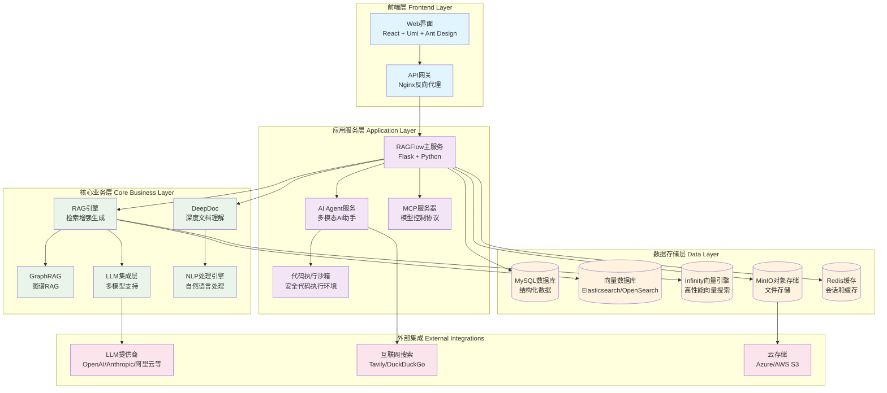
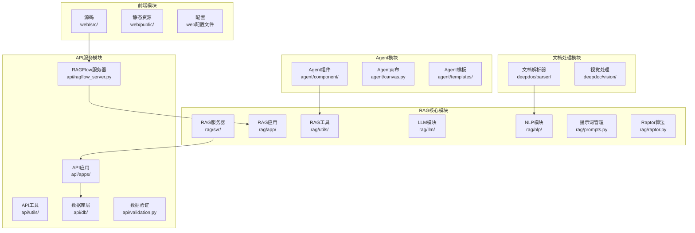
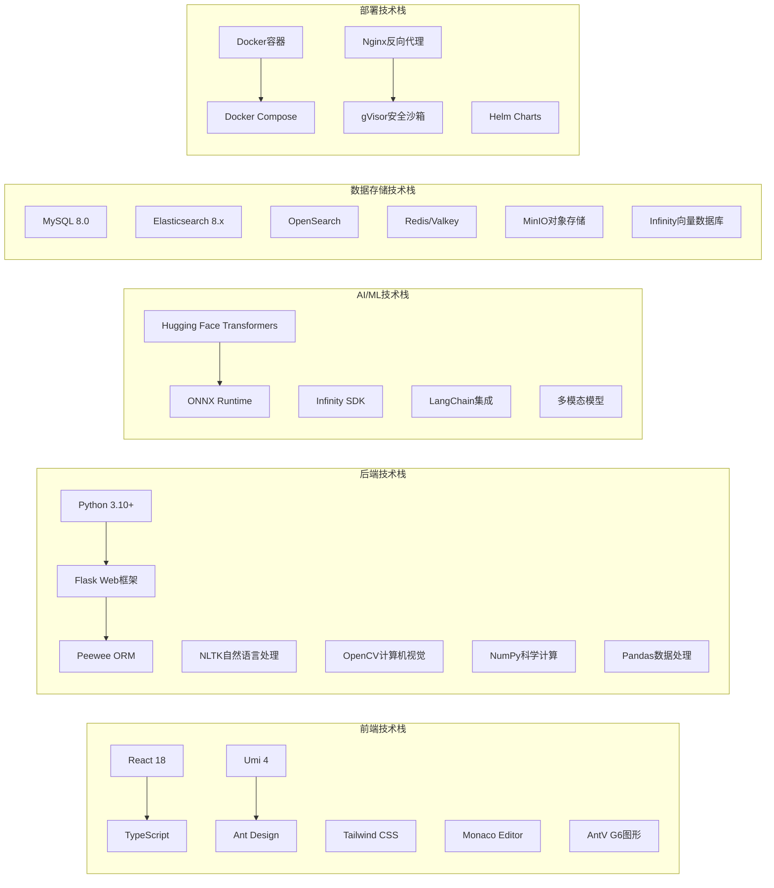
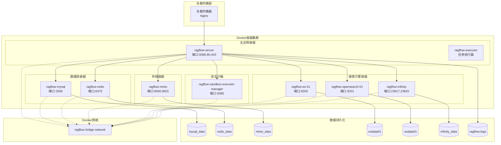
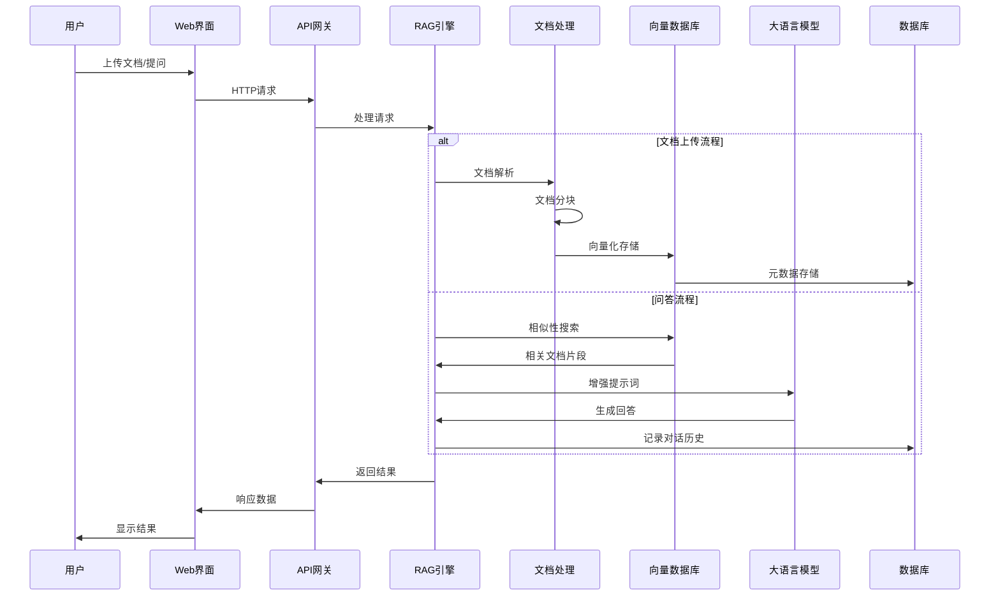
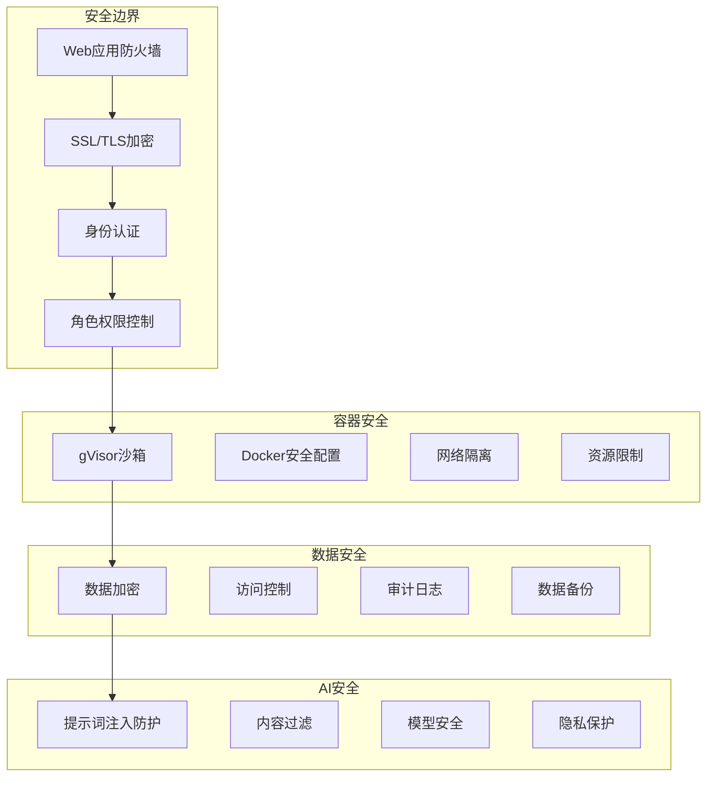

# RAGFlow 项目架构图

## 1. 系统概览架构

## 2. 核心模块架构

## 3. 技术栈架构

## 4. 部署架构图

## 5. 数据流架构

## 6. 安全架构

## 7. 系统特性说明

### 核心特性
- **深度文档理解**: 基于DeepDoc的文档解析和理解能力
- **多模态RAG**: 支持文本、图像、表格等多种数据类型
- **AI Agent**: 智能助手功能，支持推理和代码执行
- **GraphRAG**: 图谱增强的检索生成
- **多模型支持**: 集成多种LLM提供商

### 技术特色
- **高性能向量搜索**: 基于Infinity向量引擎
- **安全代码执行**: gVisor沙箱环境
- **云原生部署**: Docker容器化部署
- **水平扩展**: 微服务架构支持
- **多语言支持**: 国际化界面

### 部署选项
- **单机部署**: Docker Compose一键部署
- **集群部署**: Kubernetes + Helm Charts
- **云部署**: 支持各大云平台
- **GPU加速**: 可选GPU支持加速推理

---

*此架构图基于RAGFlow v0.19.0版本分析生成，展示了完整的系统架构、技术栈、部署方式和数据流程。* 